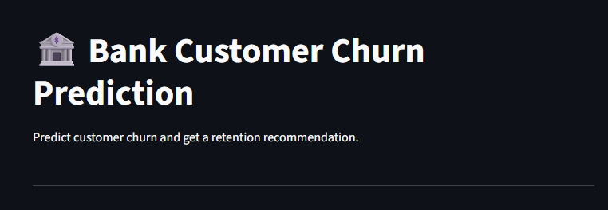
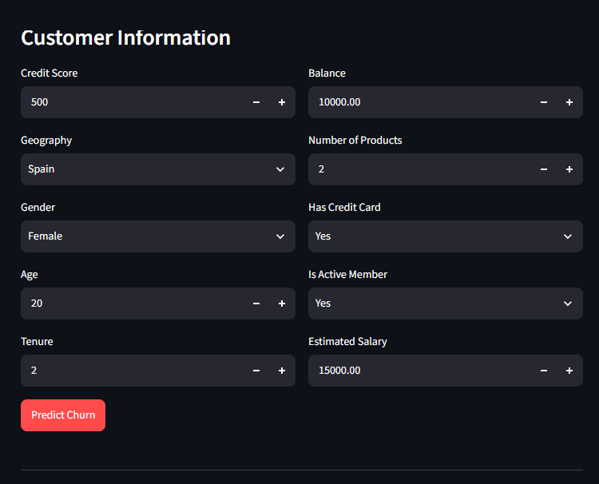
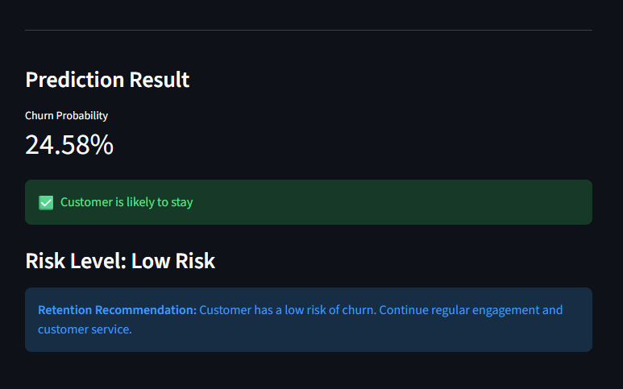

# Bank Customer Churn Prediction & Retention Recommendation System

## Overview

Customer churn is a major challenge for the banking industry. Identifying customers who are likely to leave allows banks to take proactive retention actions and improve customer relationships.

This project develops an end-to-end Machine Learning solution that predicts customer churn, estimates churn probability, classifies customers based on risk level, and provides retention recommendations.

The final model is integrated into an interactive Streamlit application for customer churn prediction.

## Business Problem

Banks need to identify customers who are at risk of leaving before they actually churn.

The objective of this project is to build a system that can:

- Predict whether a customer is likely to churn
- Estimate the probability of churn
- Identify high-risk customers
- Understand important factors associated with churn
- Provide actionable retention recommendations

## Project Objectives

- Perform data cleaning and preprocessing
- Conduct Exploratory Data Analysis (EDA)
- Analyze relationships between customer characteristics and churn
- Build and compare classification models
- Perform hyperparameter tuning
- Select the most suitable final model
- Generate churn probability and risk levels
- Develop a retention recommendation system
- Deploy the solution using Streamlit

## Dataset

The project uses a bank customer churn dataset containing 10,000 customer records.

### Features

| Feature | Description |
|---|---|
| CreditScore | Customer's credit score |
| Geography | Customer's country |
| Gender | Customer's gender |
| Age | Customer's age |
| Tenure | Number of years with the bank |
| Balance | Customer's account balance |
| NumOfProducts | Number of bank products used |
| HasCrCard | Whether the customer has a credit card |
| IsActiveMember | Whether the customer is an active member |
| EstimatedSalary | Customer's estimated salary |

### Target Variable

**Exited**

- `0` = Customer stayed
- `1` = Customer churned

### Removed Columns

- RowNumber
- CustomerId
- Surname

These columns were removed because they are identifiers and do not provide meaningful predictive information.

## Exploratory Data Analysis

The dataset was analyzed using both univariate and bivariate analysis.

### Univariate Analysis

- Distribution of numerical variables
- Count plots for categorical variables
- Box plots
- Skewness analysis

### Bivariate Analysis

- Numerical variables vs. churn
- Categorical variables vs. churn
- Churn rate analysis

### Correlation Analysis

A correlation heatmap was used to analyze relationships between numerical variables.

### Key Insights

- France has the largest customer base.
- Most customers use one or two banking products.
- Age shows noticeable positive skewness.
- Age has a relatively strong positive relationship with churn.
- Active members generally show lower churn tendency.
- Different demographic and banking characteristics show different churn patterns.

## Data Preprocessing

The following preprocessing steps were performed:

1. Removed irrelevant identifier columns.
2. Checked missing values and duplicate records.
3. Separated features and target variable.
4. Split the dataset into training and testing sets.
5. Applied One-Hot Encoding to categorical variables.
6. Applied Standard Scaling to numerical variables.
7. Combined preprocessing and model training using a Scikit-learn Pipeline.

### Train-Test Split

- Training Data: 80%
- Testing Data: 20%

## Machine Learning Models

The following classification algorithms were evaluated:

- Logistic Regression
- Decision Tree Classifier
- Random Forest Classifier

### Evaluation Metrics

- Accuracy
- Precision
- Recall
- F1 Score
- ROC-AUC
- Confusion Matrix

## Hyperparameter Tuning

Random Forest was selected for hyperparameter tuning to improve its ability to identify customers who are likely to churn.

### Random Forest Performance

| Metric | Before Tuning | After Tuning |
|---|---:|---:|
| Accuracy | 85% | 79% |
| Precision | 77% | 49% |
| Recall | 42% | 75% |
| F1 Score | 54% | 60% |
| ROC-AUC | 69.5% | 78% |

After tuning, accuracy and precision decreased, while recall, F1 Score, and ROC-AUC improved.

Since the primary business objective is to identify customers who are at risk of churn, recall is particularly important.

Therefore, the tuned Random Forest Classifier was selected as the final model.

## Final Model Evaluation

### Confusion Matrix

| | Predicted 0 | Predicted 1 |
|---|---:|---:|
| Actual 0 | 1280 | 313 |
| Actual 1 | 98 | 309 |

### Interpretation

- 1280 customers were correctly predicted as staying.
- 309 customers were correctly identified as churners.
- 313 customers were incorrectly predicted as churners.
- 98 actual churners were missed by the model.

The final model identified approximately 76% of actual churners.

### Final Model Performance

- Accuracy: 79%
- Precision: 49%
- Recall: 75%
- F1 Score: 60%
- ROC-AUC: 78%

## Feature Importance

Feature importance from the Random Forest model was used to understand which customer characteristics contribute most to the model's predictions.

This analysis helps identify important churn-related factors and supports the development of targeted retention strategies.

### Feature Importance Visualization

Add your feature importance image here:

## Churn Risk Classification

The model generates a churn probability for each customer.

Customers are classified into three risk levels:

| Churn Probability | Risk Level |
|---|---|
| Less than 40% | Low Risk |
| 40% - 69% | Medium Risk |
| 70% or above | High Risk |

This allows the bank to prioritize customers who require greater attention.

## Retention Recommendation System

The project extends churn prediction into a Retention Recommendation System.

The system uses the predicted churn probability and customer risk level to provide suitable retention actions.

### High Risk

Recommended actions:

- Personalized retention offers
- Customer engagement calls
- Loyalty benefits
- Targeted customer support

### Medium Risk

Recommended actions:

- Personalized communication
- Targeted offers
- Increased customer engagement
- Monitoring customer activity

### Low Risk

Recommended actions:

- Continue regular customer service
- Maintain customer engagement
- Monitor customer behavior

## Streamlit Application

An interactive Streamlit web application was developed to provide an easy-to-use interface for customer churn prediction.

The application allows users to enter customer information and receive:

- Churn prediction
- Churn probability
- Risk level
- Retention recommendation

### Application Workflow

Customer Information → Preprocessing Pipeline → Tuned Random Forest → Churn Probability → Risk Level → Retention Recommendation

## Streamlit Application Screenshot

## Project Structure

Bank-Customer-Churn-Prediction/

├── data/

│   └── Churn_Modelling.csv

├── images/

│   ├── streamlit_output.png

│   ├── streamlit_prediction.png

│   └── feature_importance.png

├── app.py

├── churn_model.pkl

├── .gitignore

└── README.md

## Technologies Used

### Programming Language

- Python

### Data Analysis

- Pandas
- NumPy

### Data Visualization

- Matplotlib
- Seaborn

### Machine Learning

- Scikit-learn

### Deployment

- Streamlit

### Model Saving

- Joblib

### Version Control

- Git
- GitHub

## Installation

### Clone the Repository

git clone YOUR_GITHUB_REPOSITORY_URL

### Navigate to the Project Directory

cd Bank-Customer-Churn-Prediction

### Install Required Libraries

pip install -r requirements.txt

## Run the Application

Run the following command:

python -m streamlit run app.py

The Streamlit application will open in your default web browser.

## Business Impact

This system can help banks move from reactive customer management to proactive customer retention.

Potential business benefits include:

- Early identification of customers at risk of churn
- Better prioritization of high-risk customers
- Targeted retention strategies
- Improved customer engagement
- Data-driven decision making
- Potential reduction in customer loss

## Future Scope

- Improve model performance using advanced machine learning algorithms
- Optimize the prediction threshold based on business costs
- Add personalized retention offers based on customer behavior
- Integrate the system with a live banking database
- Deploy the application on a cloud platform
- Add customer segmentation
- Add interactive business intelligence dashboards
- Implement real-time customer monitoring

## Conclusion

This project demonstrates a complete end-to-end Machine Learning workflow for bank customer churn prediction and retention.

The solution covers data cleaning, exploratory data analysis, preprocessing, model training, hyperparameter tuning, model evaluation, churn probability prediction, risk classification, retention recommendations, and Streamlit deployment.

The tuned Random Forest model achieved 75% recall and 78% ROC-AUC, allowing the system to identify a significant proportion of customers who are at risk of churn.

By combining churn prediction with actionable retention recommendations, this project provides both predictive insights and business-oriented recommendations that can support customer retention strategies.

## Author

Simran

B.Tech - Computer Science & Engineering (AI/ML)

## Acknowledgement

This project was developed as part of my Machine Learning and Data Analytics portfolio to demonstrate practical skills in data analysis, machine learning, model evaluation, and application deployment.
